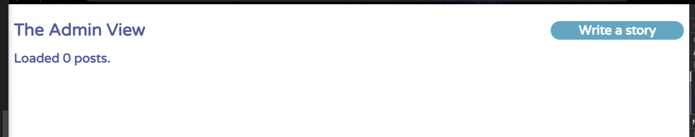
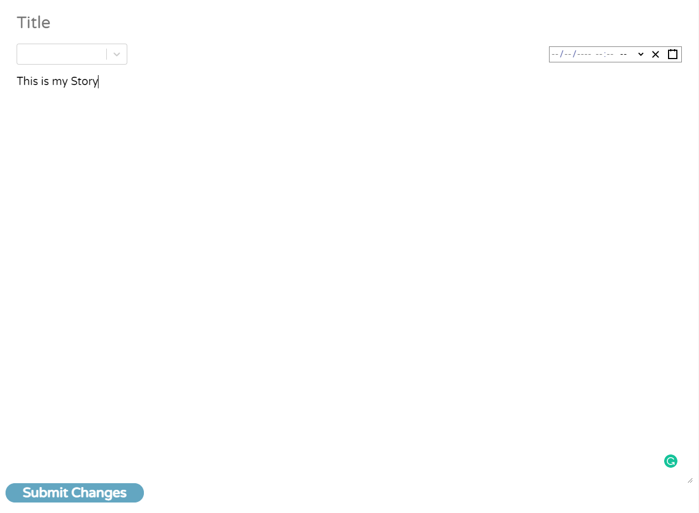
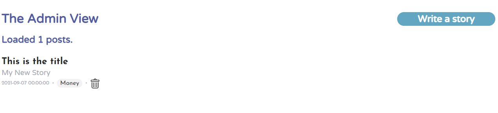
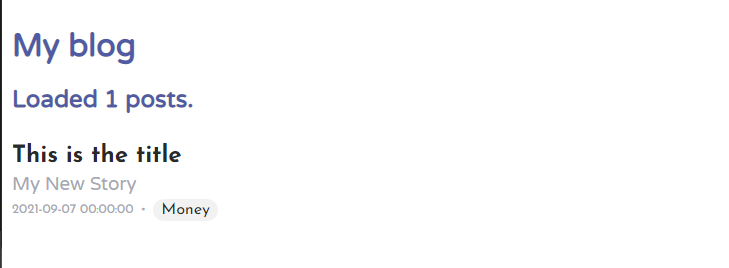

# MERN Blog System

**This blog has**

* The post editor should accept Markdown. You can use either your own solution or an existing package.
* Each post should have a category. The category list can be hardcoded in the application.
* The blog's home should list the posts ordered by creation time. In the post editor, you can change the creation time anytime.
* Each post listed in the blog's home should have a link to the post in a single view. The route for a post should be `/{category-name}/{post-title-in-this-format}`.
* The blog's admin view should list the posts ordered by creation time and should list: title, category and creation time. It also should have a link per post to edit the post in the post editor.
* Deleting posts from the admin view.

**Doesn't have**

* This blog engine doesn't have an authentication system.

The app will be connected to a MongoDB instance, which has the same connection information:

```
Host: mongodb:27017
```

## Run the project
* Run the DB using docker to get an instance of mongoDB
```
docker-compose up -d
```
* Then run the backend and frontend

```
npm run start
```
* Then go to postman and create a category using this endpoint http://localhost:3000/api/categories as a POST method using the following body:
```
{
    "name": "Money"
}
```

you can create more categories using the same endpoint with the body.
 You will get the following response:

 ```
 {
    "_id": "6104300908eab498a8352ceb",
    "name": "Money",
    "createdAt": "2021-07-30T16:59:53.028Z",
    "updatedAt": "2021-07-30T16:59:53.028Z",
    "__v": 0
}
 ```

**VIEWS**

There are 2 routes, http://localhost:3000/admin and http://localhost:3000

Go to admin view http://localhost:3000/admin, With admin you can create post



If you click on **write a story** button you will redirect to the following page.



Enter a title, story, date and category for the post, them submit it.
You will be redirect to the following view. You can edit or delete the post if you want.



The user is the same but you cant edit or delete post. You can go to user view with this link http://localhost:3000


